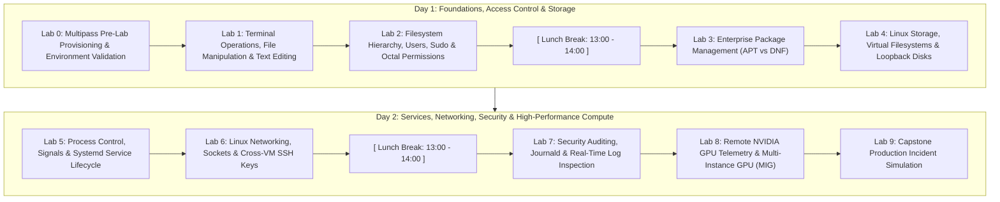

# UKM Warisan Linux Administration Practical Lab Exercises
**2-Day Intensive Hands-On Practical Lab Guide & Assessment Challenges**  
*Operating Environments: Canonical Multipass (Ubuntu 24.04 LTS & Rocky Linux 9) + Remote NVIDIA GPU Node*

---

## 📋 Course Lab Roadmap & Schedule Alignment



---

## 🛠️ Lab 0: Multipass Pre-Lab Provisioning & Environment Validation

**Target Environment:** Local Host Terminal (Windows PowerShell or macOS Terminal)  
**Estimated Time:** 20 Minutes  
**Prerequisites:** Canonical Multipass installed ([multipass.run](https://multipass.run/))

### 🎯 Objectives
1. Launch dual Linux distribution instances: **Ubuntu 24.04 LTS** and **Rocky Linux 9**.
2. Allocate compute, memory, and disk quotas.
3. Validate kernel systemd initialization state across both virtual machines.

### 📝 Step-by-Step Exercise Tasks

#### Task 0.1: Provision the Ubuntu 24.04 Virtual Machine
Launch an Ubuntu 24.04 LTS cloud instance named `ubuntu` configured with 2 CPU cores, 2GB RAM, and 10GB disk storage:
```bash
multipass launch 24.04 --name ubuntu --cpus 2 --memory 2G --disk 10G
```

#### Task 0.2: Provision the Rocky Linux 9 Virtual Machine
Launch a Rocky Linux 9 cloud instance named `rockylinux` using the appropriate hardware architecture image:

- **For Intel / AMD (x86_64):**
  ```bash
  multipass launch https://rocky.mirror.thegigabit.com/9.8/images/x86_64/Rocky-9-GenericCloud-Base.latest.x86_64.qcow2 --name rockylinux --cpus 2 --memory 2G --disk 10G
  ```
- **For Apple Silicon (M1/M2/M3/M4 - aarch64):**
  ```bash
  multipass launch https://rocky.mirror.thegigabit.com/9.8/images/aarch64/Rocky-9-GenericCloud-Base.latest.aarch64.qcow2 --name rockylinux --cpus 2 --memory 2G --disk 10G
  ```

#### Task 0.3: Inspect Virtual Machine States & Network Addressing
List all active Multipass instances and note their assigned internal IP addresses:
```bash
multipass list
```
*Expected Output:*
```text
Name                    State             IPv4             Image
rockylinux              Running           10.x.x.x         Rocky Linux 9
ubuntu                  Running           10.x.x.y         Ubuntu 24.04 LTS
```

#### Task 0.4: Validate Systemd Runtime Status
Enter each VM and confirm the initialization system has reached a functional runtime state:
```bash
# Verify Ubuntu instance
multipass exec ubuntu -- systemctl is-system-running

# Verify Rocky Linux instance
multipass exec rockylinux -- systemctl is-system-running
```
*Expected Output:* `running` or `degraded` (degraded is normal in lightweight cloud-init VMs).

---

## 💻 Lab 1: Terminal Operations, File Manipulation & Text Editing

**Target Environment:** `ubuntu` instance  
**Module Schedule:** Day 1 (10:00 – 11:30)  
**Reference:** [LINUX_TRAINEE_WORKBOOK.md](LINUX_TRAINEE_WORKBOOK.md) Section 1

### 🎯 Objectives
1. Deconstruct the standard Linux terminal prompt metadata.
2. Master absolute vs. relative directory path traversal.
3. Perform recursive folder creation, file duplication, relocation, and deletion.
4. Chain commands using standard streams (`stdin`, `stdout`, `stderr`) and pipelines (`|`).
5. Create and edit system files safely using GNU `nano`.

---

### 📝 Step-by-Step Exercise Tasks

#### Task 1.1: Terminal Prompt Analysis & Working Directory
1. Open an interactive shell inside your Ubuntu VM:
   ```bash
   multipass shell ubuntu
   ```
2. Examine the shell prompt. Identify:
   - Current username: `ubuntu`
   - Hostname: `ubuntu`
   - Active working directory symbol: `~`
   - Privilege indicator: `$` (unprivileged user)
3. Print the absolute pathname of your current location:
   ```bash
   pwd
   ```
   *Expected Output:* `/home/ubuntu`

#### Task 1.2: Directory Hierarchy & Hidden Files
1. Create a nested project structure in one command:
   ```bash
   mkdir -p ~/workspace/project-alpha/config ~/workspace/project-alpha/logs ~/workspace/backups
   ```
2. Verify the directory tree:
   ```bash
   ls -la ~/workspace/project-alpha
   ```
3. Notice the special entries `.` (current directory) and `..` (parent directory).
4. Navigate into `config` using relative navigation, then return to your home folder in a single command:
   ```bash
   cd ~/workspace/project-alpha/config
   cd ~/
   ```

#### Task 1.3: File Creation, Copying & Renaming
1. Create a blank configuration placeholder file:
   ```bash
   touch ~/workspace/project-alpha/config/app.conf
   ```
2. Create a timestamped backup copy inside `~/workspace/backups/`:
   ```bash
   cp ~/workspace/project-alpha/config/app.conf ~/workspace/backups/app.conf.bak
   ```
3. Move and rename `app.conf.bak` to `app.conf.old`:
   ```bash
   mv ~/workspace/backups/app.conf.bak ~/workspace/backups/app.conf.old
   ```
4. Verify file existence and remove `app.conf.old`:
   ```bash
   rm ~/workspace/backups/app.conf.old
   ```

#### Task 1.4: Standard Streams, Redirection & Pipelines
1. Redirect standard output (`stdout`) to create an inventory log:
   ```bash
   echo "=== SYSTEM INITIALIZATION LOG ===" > ~/workspace/project-alpha/logs/init.log
   date >> ~/workspace/project-alpha/logs/init.log
   whoami >> ~/workspace/project-alpha/logs/init.log
   ```
2. Attempt to list a non-existent folder and redirect standard error (`stderr` - FD 2) to a separate file:
   ```bash
   ls /nonexistent_folder 2> ~/workspace/project-alpha/logs/errors.log
   cat ~/workspace/project-alpha/logs/errors.log
   ```
3. Chain commands using the pipeline operator (`|`) to inspect system accounts containing `bash` as their default shell:
   ```bash
   cat /etc/passwd | grep "/bin/bash" | cut -d: -f1
   ```

#### Task 1.5: Editing with GNU `nano`
1. Open `app.conf` in nano:
   ```bash
   nano ~/workspace/project-alpha/config/app.conf
   ```
2. Enter the following configuration block:
   ```ini
   # Project Alpha Service Configuration
   SERVER_NAME="alpha-core-01"
   LISTEN_PORT=8080
   ENVIRONMENT="staging"
   DEBUG_MODE=false
   MAX_CONNECTIONS=500
   ```
3. Save the file: Press `Ctrl + O`, then hit `Enter`.
4. Exit the editor: Press `Ctrl + X`.
5. Confirm the file contents from the CLI:
   ```bash
   cat ~/workspace/project-alpha/config/app.conf
   ```

---

### 🔍 Verification & Self-Assessment Checkpoint
Run the following verification script in your shell:
```bash
test -f ~/workspace/project-alpha/config/app.conf && \
grep -q "LISTEN_PORT=8080" ~/workspace/project-alpha/config/app.conf && \
test -s ~/workspace/project-alpha/logs/init.log && \
echo "✅ LAB 1 VERIFICATION PASSED" || echo "❌ LAB 1 VERIFICATION FAILED"
```

---

## 👥 Lab 2: Filesystem Hierarchy, Users, Sudo & Octal Permissions

**Target Environment:** `ubuntu` and `rockylinux` instances  
**Module Schedule:** Day 1 (11:30 – 13:00)  
**Reference:** [LINUX_TRAINEE_WORKBOOK.md](LINUX_TRAINEE_WORKBOOK.md) Section 2

### 🎯 Objectives
1. Map the Filesystem Hierarchy Standard (FHS) across `/etc`, `/var`, `/home`, `/usr`, and `/tmp`.
2. Provision system user accounts with customized homes and login shells.
3. Configure administrative privilege escalation: Ubuntu (`sudo` group) vs. Rocky Linux (`wheel` group).
4. Parse POSIX 9-bit permission strings (`rwxr-xr-x`).
5. Calculate and apply octal permission masks (`755`, `644`, `600`, `700`).
6. Differentiate between execute (`x`) permissions on files vs. directories.

---

### 📝 Step-by-Step Exercise Tasks

#### Task 2.1: Filesystem Hierarchy Standard (FHS) Inspection
1. From the `ubuntu` shell, query the characteristics of core system directories:
   ```bash
   ls -ld / /etc /var/log /home /tmp /proc
   ```
2. Observe `/proc`: Note that the size on disk is reported as `0 bytes` because `/proc` is a virtual window into the Linux kernel memory state.
3. Query CPU details directly through the `/proc` filesystem:
   ```bash
   cat /proc/cpuinfo | grep "model name" | head -n 1
   ```

#### Task 2.2: User Account Creation & Management (Ubuntu)
1. Create a new engineering user named `alex` with a dedicated home directory and standard bash shell:
   ```bash
   sudo useradd -m -s /bin/bash alex
   ```
2. Assign a password to the user account:
   ```bash
   sudo passwd alex
   # Type a password of your choice (e.g., 'Pass1234!')
   ```
3. Inspect the account registration in `/etc/passwd`:
   ```bash
   grep alex /etc/passwd
   ```
   *Verify the 7 fields:* `username:password_placeholder:UID:GID:comment:home_directory:shell`

#### Task 2.3: Admin Privilege Escalation (Ubuntu vs Rocky Linux)
1. **On Ubuntu:** Add `alex` to the administrative `sudo` group:
   ```bash
   sudo usermod -aG sudo alex
   id alex
   ```
   *Expected Output:* `uid=1001(alex) gid=1001(alex) groups=1001(alex),27(sudo)`
2. Test sudo privileges by switching user to `alex`:
   ```bash
   su - alex
   sudo whoami
   # Enter alex's password when prompted. Expected output: root
   exit
   ```
3. **On Rocky Linux:** In a separate terminal window, open the Rocky Linux shell:
   ```bash
   multipass shell rockylinux
   sudo useradd -m -s /bin/bash alex
   sudo passwd alex
   # Add alex to the RHEL/Rocky admin group 'wheel':
   sudo usermod -aG wheel alex
   id alex
   exit
   ```

#### Task 2.4: POSIX Permission Slicing & Octal Math
Return to your `ubuntu` shell session:
1. Create a secure credentials workspace:
   ```bash
   mkdir -p ~/secure_vault
   touch ~/secure_vault/db_credentials.txt
   touch ~/secure_vault/deploy_script.sh
   touch ~/secure_vault/public_readme.txt
   ```
2. Apply standard enterprise permissions:
   - `db_credentials.txt`: Highly confidential (Read/Write for Owner only) ➔ **Mode 600** (`rw-------`)
   - `deploy_script.sh`: Executable automation (Read/Write/Exec for Owner, Read/Exec for Group & Others) ➔ **Mode 755** (`rwxr-xr-x`)
   - `public_readme.txt`: Standard document (Read/Write for Owner, Read for Group & Others) ➔ **Mode 644** (`rw-r--r--`)
   ```bash
   chmod 600 ~/secure_vault/db_credentials.txt
   chmod 755 ~/secure_vault/deploy_script.sh
   chmod 644 ~/secure_vault/public_readme.txt
   ```
3. Verify the permission strings:
   ```bash
   ls -l ~/secure_vault/
   ```

#### Task 2.5: Ownership & Directory Execution Permissions Investigation
1. Transfer ownership of `~/secure_vault/public_readme.txt` to user `alex`:
   ```bash
   sudo chown alex:alex ~/secure_vault/public_readme.txt
   ls -l ~/secure_vault/public_readme.txt
   ```
2. **The Directory 'x' Bit Experiment:**
   - Create a test directory with read-only permissions (no execute bit):
     ```bash
     mkdir -p ~/no_exec_dir
     touch ~/no_exec_dir/secret.txt
     chmod 644 ~/no_exec_dir
     ```
   - Attempt to enter the directory:
     ```bash
     cd ~/no_exec_dir
     ```
   - *Observation:* The shell returns `Permission denied`! In Linux, without the execute (`x`) permission on a directory, you cannot traverse into it or access file inodes inside it.
   - Restore proper permissions:
     ```bash
     chmod 755 ~/no_exec_dir
     cd ~/no_exec_dir && cd ~
     rm -rf ~/no_exec_dir
     ```

---

### 🔍 Verification & Self-Assessment Checkpoint
Run the following verification script on the `ubuntu` instance:
```bash
id alex | grep -q "sudo" && \
ls -l ~/secure_vault/db_credentials.txt | grep -q "^-rw-------" && \
ls -l ~/secure_vault/deploy_script.sh | grep -q "^-rwxr-xr-x" && \
echo "✅ LAB 2 VERIFICATION PASSED" || echo "❌ LAB 2 VERIFICATION FAILED"
```

---

## 📦 Lab 3: Enterprise Package Management (APT vs DNF)

**Target Environment:** Both `ubuntu` and `rockylinux` instances  
**Module Schedule:** Day 1 (14:00 – 15:00)  
**Reference:** [LINUX_TRAINEE_WORKBOOK.md](LINUX_TRAINEE_WORKBOOK.md) Section 3

### 🎯 Objectives
1. Compare upstream package ecosystems: `.deb` (`dpkg`/`apt`) vs. `.rpm` (`rpm`/`dnf`).
2. Refresh and inspect local package repository metadata caches.
3. Search, inspect, install, and verify system packages (`nginx`, `htop`, `tree`).
4. Trace installed files back to their parent package.
5. Contrast clean software removal (`remove`) versus complete purge (`purge`).

---

### 📝 Step-by-Step Exercise Tasks

#### Task 3.1: Ubuntu Package Management (`apt`)
From your `ubuntu` shell:
1. Refresh the local package repository metadata index:
   ```bash
   sudo apt update
   ```
2. Search for the process viewer `htop` and display its detailed package metadata:
   ```bash
   apt search htop
   apt show htop
   ```
3. Install `nginx` and `htop` non-interactively:
   ```bash
   sudo apt install -y nginx htop tree
   ```
4. Confirm installation by inspecting binary paths and versions:
   ```bash
   which nginx
   nginx -v
   ```
5. **Reverse Lookup:** Identify which package owns `/etc/nginx/nginx.conf`:
   ```bash
   dpkg -S /etc/nginx/nginx.conf
   ```
   *Expected Output:* `nginx-core: /etc/nginx/nginx.conf` or `nginx: ...`

#### Task 3.2: Rocky Linux Package Management (`dnf`)
Switch to the `rockylinux` terminal window:
1. Check for available system package updates:
   ```bash
   sudo dnf check-update
   ```
2. Query repository information for `nginx`:
   ```bash
   dnf info nginx
   ```
3. Install `nginx` and `htop`:
   ```bash
   sudo dnf install -y nginx htop tree
   ```
4. Confirm installation:
   ```bash
   which nginx
   nginx -v
   ```
5. **Reverse Lookup:** Identify which RPM package owns `/etc/nginx/nginx.conf`:
   ```bash
   rpm -qf /etc/nginx/nginx.conf
   ```
   *Expected Output:* `nginx-...`

#### Task 3.3: Package Removal & Cache Cleanup
1. On Ubuntu, observe the difference between `remove` and `purge`:
   - `sudo apt remove nginx`: Removes binary files but leaves configuration files in `/etc/nginx/`.
   - `sudo apt purge nginx`: Removes binaries AND completely erases `/etc/nginx/`.
   - Reinstall Nginx to ensure it is available for Day 2:
     ```bash
     sudo apt install -y nginx
     ```
2. Clean downloaded `.deb` / `.rpm` cache files to conserve disk space:
   - On Ubuntu: `sudo apt clean`
   - On Rocky Linux: `sudo dnf clean all`

---

### 🔍 Verification & Self-Assessment Checkpoint
Run the following checks:
```bash
# On Ubuntu:
dpkg -l | grep -q nginx && which htop && echo "✅ UBUNTU APT VERIFICATION PASSED"

# On Rocky Linux:
rpm -q nginx && which htop && echo "✅ ROCKY DNF VERIFICATION PASSED"
```

---

## 🗄️ Lab 4: Linux Storage, Virtual Filesystems & Loopback Disks

**Target Environment:** `ubuntu` instance (with optional validation on `rockylinux`)  
**Module Schedule:** Day 1 (15:00 – 16:00)  
**Reference:** [LINUX_TRAINEE_WORKBOOK.md](LINUX_TRAINEE_WORKBOOK.md) Section 4

### 🎯 Objectives
1. Analyze filesystem capacity with `df -h` and directory space consumption with `du -sh`.
2. Diagnose space-hogging directories using piped sorting commands.
3. Construct a virtual raw block storage image file using `dd`.
4. Format block devices with modern Linux filesystems (`ext4` and `xfs`).
5. Mount virtual block devices to the VFS tree, perform file I/O, and safely unmount.
6. Understand the architecture of `/etc/fstab` for permanent boot mounts.

---

### 📝 Step-by-Step Exercise Tasks

#### Task 4.1: Storage Telemetry & Space Diagnostics
From your `ubuntu` shell:
1. Inspect all currently mounted filesystems and human-readable capacity:
   ```bash
   df -h
   ```
   *Identify the root filesystem (`/`) and its percentage utilization.*
2. Check available inode capacity (file index nodes):
   ```bash
   df -i
   ```
3. Identify top storage-consuming directories under `/var`:
   ```bash
   sudo du -sh /var/* 2>/dev/null | sort -h | tail -n 5
   ```

#### Task 4.2: Creating a Virtual Loopback Block Device
1. Allocate a 100MB raw disk image file filled with zero-bytes using `dd`:
   ```bash
   sudo dd if=/dev/zero of=/var/virtual_disk.img bs=1M count=100 status=progress
   ```
2. Verify the created image file on disk:
   ```bash
   ls -lh /var/virtual_disk.img
   ```
   *Expected Output:* Size must be exactly `100M`.

#### Task 4.3: Filesystem Formatting (ext4 vs XFS)
1. Format the image file with the `ext4` journaling filesystem:
   ```bash
   sudo mkfs.ext4 -F /var/virtual_disk.img
   ```
   *(Note: On Rocky Linux, you would use `sudo mkfs.xfs -f /var/virtual_disk.img`)*

#### Task 4.4: Mounting to the Virtual Filesystem (VFS)
1. Create a dedicated mount point directory:
   ```bash
   sudo mkdir -p /mnt/virtual_storage
   ```
2. Attach and mount the loopback block device:
   ```bash
   sudo mount -o loop /var/virtual_disk.img /mnt/virtual_storage
   ```
3. Verify that the new storage partition appears in `df`:
   ```bash
   df -h /mnt/virtual_storage
   ```
   *Expected Output:* Displays `/mnt/virtual_storage` with approximately `93M-97M` usable capacity.

#### Task 4.5: Storage I/O & Clean Unmounting
1. Write a test dataset into the virtual disk:
   ```bash
   echo "UKM Warisan Linux Storage Lab" | sudo tee /mnt/virtual_storage/sample_data.txt
   ls -la /mnt/virtual_storage/
   cat /mnt/virtual_storage/sample_data.txt
   ```
2. Cleanly unmount the device (flushing cached dirty pages from kernel memory to disk):
   ```bash
   sudo umount /mnt/virtual_storage
   ```
3. Confirm that the mount point is now empty and disconnected:
   ```bash
   ls -la /mnt/virtual_storage/
   df -h | grep virtual_storage || echo "Storage successfully unmounted!"
   ```

---

### 🔍 Verification & Self-Assessment Checkpoint
Run the following verification script on your `ubuntu` VM:
```bash
test -f /var/virtual_disk.img && \
sudo file /var/virtual_disk.img | grep -q "ext4 filesystem" && \
echo "✅ LAB 4 STORAGE VERIFICATION PASSED" || echo "❌ LAB 4 VERIFICATION FAILED"
```

---

## ⚙️ Lab 5: Process Control, Signals & Systemd Service Lifecycle

**Target Environment:** `ubuntu` instance  
**Module Schedule:** Day 2 (10:00 – 11:30)  
**Reference:** [LINUX_TRAINEE_WORKBOOK.md](LINUX_TRAINEE_WORKBOOK.md) Section 5

### 🎯 Objectives
1. Monitor live running processes and inspect PID / PPID hierarchies.
2. Differentiate between process execution states (`R`, `S`, `D`, `Z`).
3. Send kernel signals to manage rogue processes (`SIGTERM` 15, `SIGKILL` 9, `SIGHUP` 1).
4. Master the `systemd` service lifecycle (`start`, `stop`, `restart`, `reload`, `status`).
5. Configure and verify automatic boot enablement (`enable`, `disable`, `is-enabled`).
6. Validate service runtime health via local HTTP queries (`curl`).

---

### 📝 Step-by-Step Exercise Tasks

#### Task 5.1: Process Monitoring & Process Tree Inspection
From your `ubuntu` shell:
1. List all active processes across the entire operating system:
   ```bash
   ps aux | head -n 15
   ```
2. Locate running Nginx processes:
   ```bash
   ps aux | grep nginx
   ```
3. Display the hierarchical process tree starting from PID 1:
   ```bash
   pstree -p | head -n 25
   ```
   *Notice how all processes trace their lineage back to `systemd(1)`.*

#### Task 5.2: Inter-Process Signals & Process Termination
1. Launch a simulated background worker loop:
   ```bash
   sleep 1000 &
   ```
   *Note the job ID and PID printed by the shell (e.g. `[1] 23456`).*
2. Verify that the `sleep` process is running:
   ```bash
   pgrep -a sleep
   ```
3. **Graceful Termination (SIGTERM - Signal 15):**
   ```bash
   kill -15 $(pgrep -f "sleep 1000")
   ```
4. Verify the process was terminated:
   ```bash
   pgrep sleep || echo "Process successfully terminated via SIGTERM."
   ```

#### Task 5.3: Systemd Service Runtime Management
1. Check the current status of the Nginx web server:
   ```bash
   systemctl status nginx
   ```
2. Start the Nginx service:
   ```bash
   sudo systemctl start nginx
   ```
3. Validate that Nginx is running and responding to HTTP requests:
   ```bash
   curl -I http://localhost
   ```
   *Expected Output:* `HTTP/1.1 200 OK`
4. Test configuration reloading without dropping connections (`SIGHUP`):
   ```bash
   sudo systemctl reload nginx
   ```
5. Stop the service and verify that requests fail:
   ```bash
   sudo systemctl stop nginx
   curl -I http://localhost || echo "Service stopped as expected."
   ```

#### Task 5.4: Boot Configuration & Autostart Management
1. Start and enable Nginx so that it survives system reboots:
   ```bash
   sudo systemctl enable --now nginx
   ```
2. Verify that the service is configured to launch on boot:
   ```bash
   systemctl is-enabled nginx
   ```
   *Expected Output:* `enabled`
3. Inspect the active runtime status:
   ```bash
   systemctl is-active nginx
   ```
   *Expected Output:* `active`

---

### 🔍 Verification & Self-Assessment Checkpoint
Run the following verification script on your `ubuntu` VM:
```bash
systemctl is-active nginx | grep -q "active" && \
systemctl is-enabled nginx | grep -q "enabled" && \
curl -s http://localhost | grep -q "Welcome to nginx" && \
echo "✅ LAB 5 SYSTEMD VERIFICATION PASSED" || echo "❌ LAB 5 VERIFICATION FAILED"
```

---

## 🌐 Lab 6: Linux Networking, Sockets & Cross-VM SSH Keys

**Target Environment:** Both `ubuntu` and `rockylinux` instances  
**Module Schedule:** Day 2 (11:30 – 13:00)  
**Reference:** [LINUX_TRAINEE_WORKBOOK.md](LINUX_TRAINEE_WORKBOOK.md) Section 6

### 🎯 Objectives
1. Inspect network interfaces, IP addressing, and default routing tables.
2. Identify listening network sockets and owning processes using `ss -tulpn`.
3. Generate modern Ed25519 asymmetric cryptographic keypairs.
4. Apply strict permissions to SSH directories (`700`) and private keys (`600`).
5. Deploy public keys using `ssh-copy-id` and configure passwordless authentication.
6. Establish inter-instance SSH connections between Ubuntu and Rocky Linux VMs.

---

### 📝 Step-by-Step Exercise Tasks

#### Task 6.1: Network Inspection & Port Sockets
From your `ubuntu` shell:
1. Display all network interface configurations and IP addresses:
   ```bash
   ip -br addr show
   ```
   *Identify the internal bridge interface (e.g. `enp0s3` or `eth0`) and its IP address.*
2. Check default gateway routing:
   ```bash
   ip route show
   ```
3. Inspect listening TCP and UDP sockets along with their process IDs:
   ```bash
   sudo ss -tulpn
   ```
   *Verify that port 80 (`nginx`) and port 22 (`sshd`) are listening for connections.*

#### Task 6.2: Ensure SSH Services are Active
1. On Ubuntu:
   ```bash
   sudo systemctl enable --now ssh
   systemctl is-active ssh
   ```
2. On Rocky Linux:
   ```bash
   sudo systemctl enable --now sshd
   systemctl is-active sshd
   ```

#### Task 6.3: Generate Modern Ed25519 Keypair
From your `ubuntu` shell:
1. Create the `~/.ssh` directory with strict permissions:
   ```bash
   mkdir -p ~/.ssh
   chmod 700 ~/.ssh
   ```
2. Generate an Ed25519 SSH keypair with no passphrase:
   ```bash
   ssh-keygen -t ed25519 -N "" -f ~/.ssh/id_ed25519
   ```
3. Inspect the generated files:
   ```bash
   ls -la ~/.ssh/
   ```
   - `id_ed25519`: Private key (**CONFIDENTIAL - Mode 600**)
   - `id_ed25519.pub`: Public key (Shareable with remote servers)
4. Enforce strict permissions:
   ```bash
   chmod 600 ~/.ssh/id_ed25519
   chmod 644 ~/.ssh/id_ed25519.pub
   ```

#### Task 6.4: Localhost Passwordless Authentication
1. Install your public key onto your local machine's `authorized_keys`:
   ```bash
   ssh-copy-id -i ~/.ssh/id_ed25519.pub localhost
   ```
   *(Enter the user password if prompted once).*
2. Test SSH connection to `localhost` without entering a password:
   ```bash
   ssh -o BatchMode=yes localhost "echo '✅ Localhost passwordless SSH connection verified!'"
   ```

#### Task 6.5: Cross-VM SSH Communication (Ubuntu to Rocky Linux)
1. In your host terminal, run `multipass list` to retrieve the IP address of the `rockylinux` VM.
2. In the `rockylinux` shell, set a known password for the `rocky` (or `alex`) user:
   ```bash
   sudo passwd ubuntu 2>/dev/null || sudo passwd rockylinux 2>/dev/null || sudo passwd alex
   ```
3. From your `ubuntu` shell, copy your Ed25519 public key to the Rocky Linux VM:
   ```bash
   # Replace <ROCKY_IP> with the IP address shown in multipass list
   ssh-copy-id -i ~/.ssh/id_ed25519.pub <ROCKY_IP>
   ```
4. Establish a direct SSH session from Ubuntu into Rocky Linux:
   ```bash
   ssh <ROCKY_IP> "hostname && cat /etc/os-release | grep PRETTY_NAME"
   ```
   *Expected Output:* `Rocky Linux 9.x (Blue Onyx)`

---

### 🔍 Verification & Self-Assessment Checkpoint
Run the following test from your `ubuntu` VM:
```bash
test -f ~/.ssh/id_ed25519 && \
test -f ~/.ssh/id_ed25519.pub && \
grep -q "ssh-ed25519" ~/.ssh/authorized_keys && \
ssh -o BatchMode=yes -o StrictHostKeyChecking=no localhost "echo 'SSH SUCCESS'" | grep -q "SSH SUCCESS" && \
echo "✅ LAB 6 NETWORKING & SSH VERIFICATION PASSED" || echo "❌ LAB 6 VERIFICATION FAILED"
```

---

## 📜 Lab 7: Security Auditing, Journald & Real-Time Log Inspection

**Target Environment:** `ubuntu` instance  
**Module Schedule:** Day 2 (14:00 – 15:00)  
**Reference:** [LINUX_TRAINEE_WORKBOOK.md](LINUX_TRAINEE_WORKBOOK.md) Section 7

### 🎯 Objectives
1. Query system and kernel messages using `systemd-journald` (`journalctl`).
2. Filter logs by systemd unit (`-u`), severity priority (`-p`), and boot cycle (`-b`).
3. Stream live application events using `journalctl -f` and `tail -f`.
4. Search and analyze security events in `/var/log/auth.log` using `grep`.
5. Simulate an unauthorized access attempt and identify the forensic trail.

---

### 📝 Step-by-Step Exercise Tasks

#### Task 7.1: Structured Log Forensics with `journalctl`
From your `ubuntu` shell:
1. Query the last 20 log entries recorded for the Nginx service:
   ```bash
   sudo journalctl -u nginx -n 20 --no-pager
   ```
2. Filter system events from the **current boot** only that have an error severity or higher:
   ```bash
   sudo journalctl -p err -b --no-pager
   ```
3. Query logs recorded within the last 30 minutes:
   ```bash
   sudo journalctl --since "30 minutes ago" --no-pager | tail -n 20
   ```

#### Task 7.2: Real-Time Stream Monitoring (`tail -f` & `journalctl -f`)
1. In Terminal Window 1, start following the Nginx access log:
   ```bash
   sudo tail -f /var/log/nginx/access.log
   ```
2. In Terminal Window 2 (or a separate shell session), generate simulated web traffic:
   ```bash
   curl -s http://localhost/ > /dev/null
   curl -s http://localhost/test_page > /dev/null
   curl -s http://localhost/admin_login > /dev/null
   ```
3. Return to Terminal Window 1 and observe the incoming HTTP request lines:
   ```text
   127.0.0.1 - - [07/Sep/2026:...] "GET / HTTP/1.1" 200 ...
   127.0.0.1 - - [07/Sep/2026:...] "GET /test_page HTTP/1.1" 404 ...
   ```
   *Press `Ctrl + C` to exit log following.*

#### Task 7.3: Security Log Inspection with `grep`
1. Simulate a failed authentication attempt:
   ```bash
   su - non_existent_user 2>/dev/null
   # When prompted, press Enter or type invalid credentials
   ```
2. Search the authentication log for failed access events:
   ```bash
   sudo grep -i "failed" /var/log/auth.log 2>/dev/null || sudo grep -i "failed" /var/log/syslog
   ```
3. Extract unique IP addresses attempting authentication or connecting to services:
   ```bash
   sudo grep "HTTP/1.1" /var/log/nginx/access.log | awk '{print $1}' | sort | uniq -c
   ```

---

### 🔍 Verification & Self-Assessment Checkpoint
Confirm that log auditing tools function properly:
```bash
sudo journalctl -u nginx -n 1 > /dev/null && \
test -f /var/log/nginx/access.log && \
echo "✅ LAB 7 LOGGING VERIFICATION PASSED" || echo "❌ LAB 7 VERIFICATION FAILED"
```

---

## ⚡ Lab 8: Remote NVIDIA GPU Telemetry & Multi-Instance GPU (MIG)

**Target Environment:** Dedicated Remote Bare-Metal GPU Server (NVIDIA A100 / H200)  
**Module Schedule:** Day 2 (15:00 – 16:00)  
**Reference:** [LINUX_TRAINEE_WORKBOOK.md](LINUX_TRAINEE_WORKBOOK.md) Section 8

> [!IMPORTANT]
> **Environment Notice:** This lab requires bare-metal datacenter GPU hardware. Trainees will connect to the assigned GPU server via SSH using credentials supplied by the instructor:  
> `ssh traineeX@gpu-node.ukm-training.internal`

### 🎯 Objectives
1. Perform real-time GPU telemetry queries using `nvidia-smi`.
2. Extract scriptable CSV metrics for automated cluster monitoring.
3. Track active compute processes and VRAM consumption.
4. Enable hardware Multi-Instance GPU (MIG) mode (`-mig 1`).
5. Query supported GPU Instance profiles and carve physical slices (`-cgi ... -C`).
6. Bind AI workloads to specific hardware slices via `CUDA_VISIBLE_DEVICES`.
7. Execute clean teardown and state restoration (`-dgi`).

---

### 📝 Step-by-Step Exercise Tasks

#### Task 8.1: GPU Health & Architecture Telemetry
Once connected to the remote GPU node:
1. Display the standard NVIDIA System Management Interface dashboard:
   ```bash
   nvidia-smi
   ```
   *Identify:*
   - GPU Model (e.g. `NVIDIA A100-SXM4-80GB`)
   - Driver Version and supported CUDA Version
   - Current GPU Temperature & Power Usage vs. TDP Limit
   - Total vs. Allocated VRAM
2. Run continuous real-time telemetry refreshing every 1 second:
   ```bash
   nvidia-smi -l 1
   ```
   *(Press `Ctrl + C` to exit).*

#### Task 8.2: Scriptable CSV Queries & Process Tracking
1. Query key performance indicators in structured CSV format:
   ```bash
   nvidia-smi --query-gpu=index,name,temperature.gpu,utilization.gpu,memory.used,memory.total,power.draw --format=csv
   ```
2. Query compute processes and verify VRAM allocations:
   ```bash
   nvidia-smi --query-compute-apps=gpu_uuid,pid,process_name,used_memory --format=csv
   ```

#### Task 8.3: Enabling Multi-Instance GPU (MIG) Mode
1. Query whether MIG is currently enabled on GPU 0:
   ```bash
   nvidia-smi -i 0 --query-gpu=index,name,mig.mode.current --format=csv
   ```
2. Enable MIG mode on GPU index 0 (requires root):
   ```bash
   sudo nvidia-smi -i 0 -mig 1
   ```
3. Confirm that MIG mode shows `Enabled`:
   ```bash
   nvidia-smi -i 0 --query-gpu=mig.mode.current --format=csv
   ```

#### Task 8.4: Listing Profiles & Creating Slices
1. List all supported GPU Instance profiles available on GPU 0:
   ```bash
   nvidia-smi mig -lgip -i 0
   ```
   *Example Profile Map (NVIDIA A100 80GB):*
   | Profile ID | Profile Name | Slices / Memory | Max Instances |
   | :---: | :--- | :--- | :---: |
   | **19** | `1g.10gb` | 1 Compute Slice / 10GB VRAM | 7 |
   | **14** | `2g.20gb` | 2 Compute Slices / 20GB VRAM | 3 |
   | **9** | `3g.40gb` | 3 Compute Slices / 40GB VRAM | 2 |

2. Partition GPU 0 into one 20GB instance (Profile ID 14) and one 10GB instance (Profile ID 19):
   ```bash
   sudo nvidia-smi mig -cgi 14,19 -C
   ```
   *(The `-C` flag automatically provisions matching Compute Instances for each partition).*

#### Task 8.5: Inspecting Created MIG Partitions & Workload Isolation
1. List all active hardware GPU instances and note their unique UUIDs:
   ```bash
   nvidia-smi mig -lgi
   ```
2. Run standard `nvidia-smi` to view the new hardware partitions listed as discrete devices:
   ```bash
   nvidia-smi
   ```
3. **Simulate Workload Scoping:**
   Extract the UUID of your newly carved 10GB slice and bind a terminal session to it:
   ```bash
   MIG_UUID=$(nvidia-smi mig -lgi | grep "1g.10gb" | awk '{print $NF}' | head -n 1)
   export CUDA_VISIBLE_DEVICES="$MIG_UUID"
   echo "Active Scoped GPU Slice: $CUDA_VISIBLE_DEVICES"
   ```
4. Query the memory visible to an application under this scoped environment:
   ```bash
   nvidia-smi --query-gpu=name,memory.total --format=csv
   ```
   *Notice that the application sees ONLY the allocated slice (10GB) rather than the full 80GB physical card!*

#### Task 8.6: Teardown & Cluster Restoration
1. Destroy all active GPU instances and compute instances on GPU 0:
   ```bash
   sudo nvidia-smi mig -dgi -i 0
   ```
2. Verify all slices have been destroyed:
   ```bash
   nvidia-smi mig -lgi
   ```
3. Disable MIG mode to restore standard monolithic GPU operation:
   ```bash
   sudo nvidia-smi -i 0 -mig 0
   ```
4. Confirm normal monolithic status:
   ```bash
   nvidia-smi -i 0 --query-gpu=mig.mode.current --format=csv
   ```

---

### 🔍 Verification & Self-Assessment Checkpoint
Run the following check on the GPU server:
```bash
nvidia-smi --query-gpu=mig.mode.current --format=csv | grep -q "Disabled" && \
echo "✅ LAB 8 MIG LIFECYCLE & TEARDOWN VERIFICATION PASSED" || echo "❌ LAB 8 VERIFICATION FAILED"
```

---

## 🏆 Lab 9: Comprehensive Capstone Production Incident Simulation

**Scenario:** *"You have been paged as the on-call Linux Systems Engineer. A production microservice environment has reported multiple anomalies: storage capacity alerts, broken service access, and unauthorized privilege attempts."*

### 📋 Capstone Tasks (Complete All 5 Challenges)

1. **Challenge 1 (Storage Forensic):**
   A rogue process has generated a huge dummy data dump. Use `du -sh` sorting commands to locate any file over 50MB in `/var/` or `/tmp/`, record its path, and delete it.
2. **Challenge 2 (Service Restoration):**
   The Nginx web service has crashed or was stopped. Inspect `systemctl status nginx`, resolve any configuration issues, start the service, and verify HTTP 200 responses via `curl`.
3. **Challenge 3 (Security Lockout):**
   Audit `/home/ubuntu/`. Find any script with insecure `777` permissions and re-lock it to `755` (executables) or `644` (configurations).
4. **Challenge 4 (Cross-VM SSH Automation):**
   Execute a remote command from `ubuntu` to `rockylinux` using passwordless SSH to verify the remote host's kernel version (`uname -r`).
5. **Challenge 5 (Log Incident Report):**
   Extract the last 5 error messages from `journalctl -p err -b` and write them to `~/incident_report.txt`.

---

## 📚 Appendix: Comprehensive Linux Administration Cheatsheet

### Files & Navigation
```bash
pwd                                  # Print current working directory
ls -la                               # List all files including hidden dotfiles
cd ~                                 # Change to user home directory
mkdir -p /path/to/dir                # Create nested directories
touch file.txt                       # Create blank file or update timestamp
cp -r src/ dest/                     # Copy directory recursively
mv old.txt new.txt                   # Move or rename file
rm -rf dir/                          # Force delete directory recursively
cat file.txt                         # Display entire file contents
head -n 20 file.txt                  # Display first 20 lines
tail -n 20 file.txt                  # Display last 20 lines
tail -f /var/log/syslog              # Follow growing log file in real time
```

### Permissions & Users
```bash
sudo useradd -m -s /bin/bash user    # Create user with home directory and shell
sudo passwd user                     # Set user password
sudo usermod -aG sudo user           # Add user to sudo group (Ubuntu)
sudo usermod -aG wheel user          # Add user to wheel group (Rocky Linux)
id user                              # Display UID, GID, and active groups
chmod 755 script.sh                  # Owner rwx, Group rx, Others rx
chmod 644 config.yaml                # Owner rw, Group r, Others r
chmod 600 id_ed25519                 # Owner rw, Group none, Others none (Private Key)
chown user:group file                # Change user and group ownership
```

### Services & Processes
```bash
ps aux                               # List all running processes
pstree -p                            # Display process tree with PIDs
top / htop                           # Interactive process dashboard
sudo kill -15 <PID>                  # Polite termination signal (SIGTERM)
sudo kill -9 <PID>                   # Force uncatchable termination (SIGKILL)
sudo systemctl start <svc>           # Start service immediately
sudo systemctl stop <svc>            # Stop service immediately
sudo systemctl restart <svc>         # Restart service
sudo systemctl reload <svc>          # Reload configuration (SIGHUP)
systemctl status <svc>               # Inspect service runtime health & logs
sudo systemctl enable --now <svc>    # Enable on boot AND start now
systemctl is-active <svc>            # Check runtime state (active/inactive)
systemctl is-enabled <svc>           # Check boot configuration (enabled/disabled)
```

### Networking & SSH
```bash
ip addr show                         # Display network interfaces and IPs
ip route show                        # Display default gateway and routing table
ss -tulpn                            # List listening TCP/UDP ports and owning PIDs
ssh-keygen -t ed25519 -N "" -f key   # Generate Ed25519 SSH keypair
ssh-copy-id -i key.pub user@server   # Deploy public key to remote host
ssh user@server                      # Connect to remote SSH host
```

### Storage & Filesystems
```bash
df -h                                # Display filesystem capacity in GB/MB
du -sh /var/* | sort -h              # Sort directory consumption
sudo dd if=/dev/zero of=disk.img bs=1M count=100  # Create 100MB raw disk image
sudo mkfs.ext4 disk.img              # Format with ext4 (Ubuntu standard)
sudo mkfs.xfs disk.img               # Format with XFS (Rocky standard)
sudo mount -o loop disk.img /mnt/dir # Mount virtual block device
sudo umount /mnt/dir                 # Unmount filesystem
```

### NVIDIA GPU & MIG
```bash
nvidia-smi                           # Display GPU status overview table
nvidia-smi -l 1                      # Continuous 1-second refresh monitor
nvidia-smi --query-gpu=... --format=csv  # Scriptable CSV telemetry query
sudo nvidia-smi -i 0 -mig 1          # Enable Multi-Instance GPU mode
nvidia-smi mig -lgip -i 0            # List available GPU Instance profiles
sudo nvidia-smi mig -cgi <id> -C     # Create GPU & Compute Instances
nvidia-smi mig -lgi                  # List active MIG instances and UUIDs
export CUDA_VISIBLE_DEVICES="MIG-UUID"  # Restrict workload to specific slice
sudo nvidia-smi mig -dgi -i 0        # Destroy all MIG instances on GPU 0
sudo nvidia-smi -i 0 -mig 0          # Disable MIG mode
```
