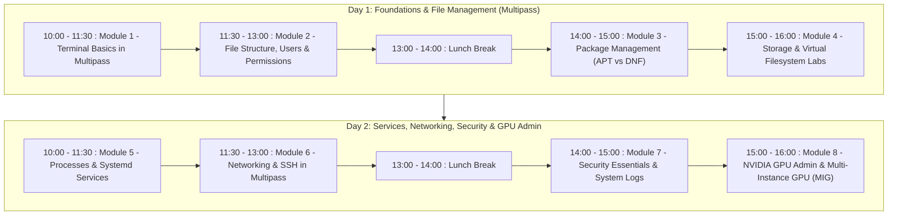
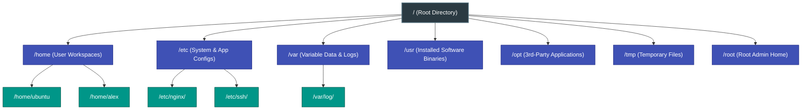
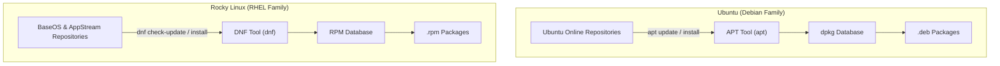
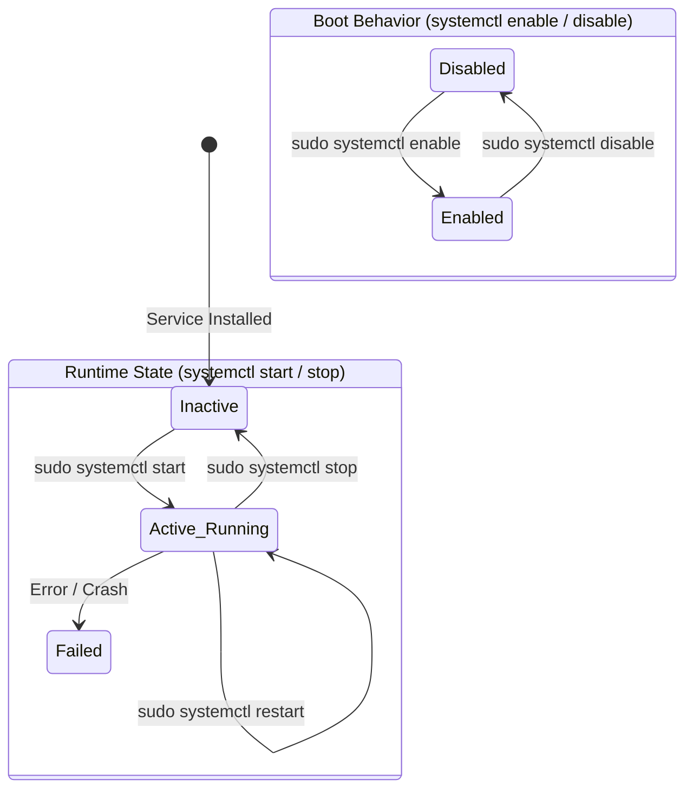
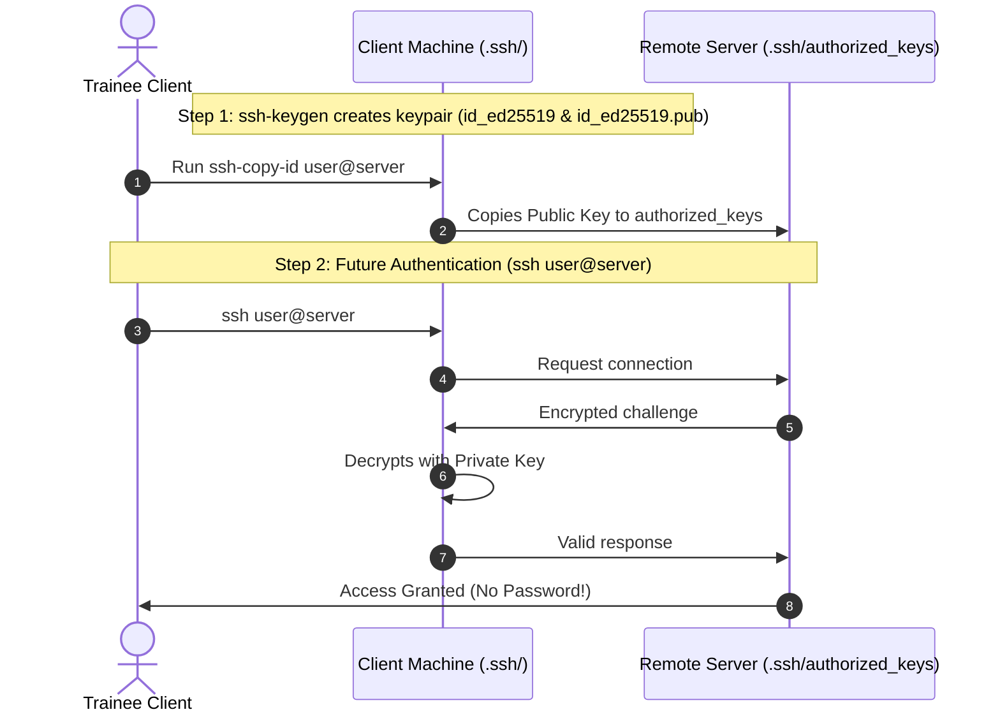
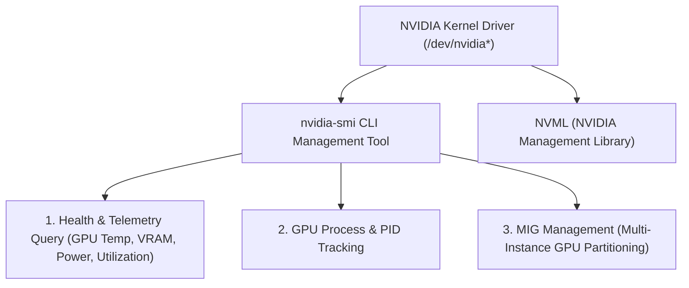
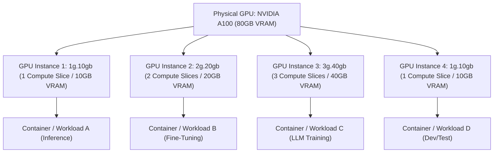

# TRAINEE WORKBOOK & LAB MANUAL
**2-Day Practical Linux System Administration Training**  
*Daily Schedule: 10:00 – 16:00 (Lunch Break: 13:00 – 14:00)*  

---

## 🛠️ Step 0: Pre-Training Lab Setup with Multipass (Windows & macOS)

Before Day 1 starts, ensure you have both Linux distributions installed and running on your machine using Canonical Multipass.

### Option A: Install Multipass on Windows 10/11
1. Right-click the **Start Menu** and choose **PowerShell (Admin)** or **Terminal (Admin)**.
2. Run:
   ```powershell
   winget install Canonical.Multipass
   ```
   *(Or download the installer from [multipass.run](https://multipass.run/))*
3. Restart your computer if prompted by Windows.

### Option B: Install Multipass on macOS
1. Open **Terminal** and run:
   ```bash
   brew install --cask multipass
   ```
   *(Or download the `.pkg` installer from [multipass.run](https://multipass.run/))*

---

### Step 1: Launch Ubuntu Instance
1. In PowerShell / macOS Terminal, run:
   ```bash
   multipass launch 24.04 --name ubuntu --cpus 2 --memory 2G --disk 10G
   ```
2. Enter the Ubuntu VM:
   ```bash
   multipass shell ubuntu
   ```

---

### Step 2: Launch Rocky Linux 9 Instance
1. In PowerShell / macOS Terminal (Intel), run:
   ```bash
   multipass launch https://rocky.mirror.thegigabit.com/9.8/images/x86_64/Rocky-9-GenericCloud-Base.latest.x86_64.qcow2 --name rockylinux --cpus 2 --memory 2G --disk 10G
   ```
	 For macOS with Apple Silicon, run:
	 ```bash
	 multipass launch https://rocky.mirror.thegigabit.com/9.8/images/aarch64/Rocky-9-GenericCloud-Base.latest.aarch64.qcow2 --name rockylinux --cpus 2 --memory 2G --disk 10G
	 ```
	
2. Enter the Rocky Linux VM:
   ```bash
   multipass shell rockylinux
   ```

---

### Step 3: Verify Systemd Status
In **both** Ubuntu and Rocky Linux shell sessions, verify that systemd is active:
```bash
systemctl is-system-running
# If it says 'running' or 'degraded', you are ready!
```

---

### Useful Multipass Shortcuts & Commands
| Task | Command |
| :--- | :--- |
| **Launch Ubuntu shell** | `multipass shell ubuntu` |
| **Launch Rocky Linux shell** | `multipass shell rockylinux` |
| **List instances & IP addresses** | `multipass list` |
| **Execute command from host** | `multipass exec ubuntu -- <command>` |
| **Mount host folder to VM** | `multipass mount /path/to/host/folder ubuntu:/mnt/shared` |
| **Stop / Start instances** | `multipass stop ubuntu` / `multipass start ubuntu` |
| **Cancel/stop any stuck command** | Press `Ctrl + C` |
| **Exit paginated logs (`less`, `journalctl`)** | Press `q` |

---

## 📅 Course Schedule (10:00 – 16:00 Daily | Lunch: 13:00 – 14:00)



| Day | Time | Module | Core Practical Objectives |
| :--- | :--- | :--- | :--- |
| **Day 1** | 10:00 – 11:30 | **Module 1: Terminal Basics in Multipass** | Prompt, navigation, file operations, `nano`. |
| | 11:30 – 13:00 | **Module 2: File Structure, Users & Permissions** | FHS tree, `sudo`, user/group creation, `chmod`/`chown`. |
| | **13:00 – 14:00** | **[ Lunch Break ]** | |
| | 14:00 – 15:00 | **Module 3: Package Management (APT vs DNF)** | Package installation & updates (`apt` vs `dnf`). |
| | 15:00 – 16:00 | **Module 4: Storage & Virtual Filesystem Labs** | `df -h`, loopback disk creation, formatting & mounting. |
| **Day 2** | 10:00 – 11:30 | **Module 5: Processes & Systemd Services** | `ps`, `kill`, `systemctl` (start/stop/enable). |
| | 11:30 – 13:00 | **Module 6: Networking & SSH in Multipass** | IP diagnostics, ports, SSH key generation & login. |
| | **13:00 – 14:00** | **[ Lunch Break ]** | |
| | 14:00 – 15:00 | **Module 7: Security Essentials & System Logs** | System log analysis (`journalctl`), auth logs, `tail -f`, `grep`. |
| | 15:00 – 16:00 | **Module 8: NVIDIA GPU Admin & MIG** *(Remote Dedicated Server)* | `nvidia-smi` diagnostics, process monitoring, GPU partitioning with MIG. |

---

## 📖 DAY 1: Foundation & Daily File Management

### Module 1: Getting Started with the Linux Terminal (10:00 – 11:30)

#### 1.1 The Terminal Prompt
```text
ubuntu@ubuntu:~$
```
- `ubuntu`: Current user.
- `ubuntu`: VM hostname.
- `~`: You are in your personal home folder (`/home/ubuntu`).
- `$`: Standard user (`#` means administrator / root).

#### 1.2 Core Navigation & File Commands
- `pwd` — Print current working directory.
- `ls -la` — List all files (including hidden files starting with `.`).
- `cd ~` — Go to home directory; `cd ..` — Go back one level.
- `mkdir -p ~/training/day1` — Create nested directories.
- `touch notes.txt` — Create a blank file.
- `cp notes.txt backup.txt` — Copy file.
- `mv backup.txt ~/training/day1/` — Move file.
- `rm notes.txt` — Delete file (`rm -r folder` to delete folder).

#### 1.3 Text Editing with `nano`
- `nano ~/training/day1/notes.txt`
- Save: `Ctrl + O` ➔ press `Enter`.
- Exit: `Ctrl + X`.
- View content: `cat ~/training/day1/notes.txt`.

---

### Module 2: File Structure, Users & Permissions (11:30 – 13:00)

#### 2.1 The Linux Filesystem Tree


#### 2.2 Permissions & Ownership Architecture
```
                   File Permission String: - r w x r - x r - -
                                           ┬ ─── ─── ───
                                           │   │   │   │
  File Type: '-' = File, 'd' = Directory ──┘   │   │   │
  User (Owner) Permissions [rwx = 4+2+1 = 7] ──┘   │   │
  Group Permissions        [r-x = 4+0+1 = 5] ──────┘   │
  Others Permissions       [r-- = 4+0+0 = 4] ──────────┘
                               Numerical Mode = 755
```



```mermaid
flowchart LR
    subgraph Permission_Values ["Permission Values"]
        R["Read (r) = 4: View content / list dir"]
        W["Write (w) = 2: Modify / delete file"]
        X["Execute (x) = 1: Run script / enter dir"]
    end

    subgraph Targets ["Targets"]
        U["User (u): Owner"]
        G["Group (g): Team"]
        O["Others (o): All others"]
    end

    subgraph Common_Modes ["Common Modes"]
        M755["755 (rwxr-xr-x): Scripts / Programs"]
        M644["644 (rw-r--r--): Config / Text files"]
        M600["600 (rw-------): Private SSH keys"]
    end

    Permission_Values --> Targets --> Common_Modes
```

#### 2.3 User & Sudo Management Commands
```bash
# Add a new user named 'alex'
sudo useradd -m -s /bin/bash alex
sudo passwd alex

# Grant administrative privileges:
# On Ubuntu:
sudo usermod -aG sudo alex

# On Rocky Linux:
sudo usermod -aG wheel alex

# Check the user's group
id alex
```

---

*(Lunch Break 13:00 – 14:00)*

---

### Module 3: Package Management (14:00 – 15:00)



| Task | Ubuntu (APT) | Rocky Linux (DNF) |
| :--- | :--- | :--- |
| **Update repository index** | `sudo apt update` | `sudo dnf check-update` |
| **Apply OS updates** | `sudo apt upgrade -y` | `sudo dnf upgrade -y` |
| **Search package** | `apt search htop` | `dnf search htop` |
| **Install Nginx & htop** | `sudo apt install -y nginx htop` | `sudo dnf install -y nginx htop` |
| **Remove software** | `sudo apt remove nginx` | `sudo dnf remove -y nginx` |

---

### Module 4: Storage & Virtual Filesystem Labs (15:00 – 16:00)

#### 4.1 Checking Storage
- `df -h` — Check available disk space in human-readable GB/MB.
- `sudo du -sh /var/* | sort -h` — Find which folders consume space.

#### 4.2 Hands-On Lab: Virtual Loopback Disk
1. **Create a 100MB virtual disk file:**
   ```bash
   sudo dd if=/dev/zero of=/var/virtual_disk.img bs=1M count=100
   ```
2. **Format the image:**
   - On Ubuntu: `sudo mkfs.ext4 /var/virtual_disk.img`
   - On Rocky Linux: `sudo mkfs.xfs /var/virtual_disk.img`
3. **Mount the disk:**
   ```bash
   sudo mkdir -p /mnt/virtual_storage
   sudo mount -o loop /var/virtual_disk.img /mnt/virtual_storage
   ```
4. **Verify:** `df -h /mnt/virtual_storage`
5. **Clean Unmount:** `sudo umount /mnt/virtual_storage`

---

## 📖 DAY 2: Services, Networking, Security & GPU Admin

### Module 5: Managing Processes & Systemd Services (10:00 – 11:30)



#### Service Management Commands (`systemctl`):
```bash
# Start Nginx
sudo systemctl start nginx

# Check status
sudo systemctl status nginx

# Enable to start automatically
sudo systemctl enable nginx

# Stop and restart
sudo systemctl restart nginx
sudo systemctl stop nginx

# Verify that the service is enabled on boot
sudo systemctl is-enabled nginx
```

---

### Module 6: Networking & Remote SSH Access (11:30 – 13:00)



#### Hands-On SSH Lab:
1. **Start SSH service:**
   - Ubuntu: `sudo systemctl start ssh`
   - Rocky Linux: `sudo systemctl start sshd`
2. **Generate ED25519 keypair:**
   ```bash
   ssh-keygen -t ed25519 -N "" -f ~/.ssh/id_ed25519
   ```
3. **Copy public key to localhost:**
   ```bash
   ssh-copy-id -i ~/.ssh/id_ed25519.pub localhost
   ```
4. **Log in without entering password:**
   ```bash
   ssh localhost
   ```
5. **Cross-VM SSH Communication:**
   - From your host machine terminal, run `multipass list` to view the IP addresses assigned to `ubuntu` and `rockylinux`.
   - From the `ubuntu` shell, SSH directly into Rocky Linux using its IP address.

---

*(Lunch Break 13:00 – 14:00)*

---

### Module 7: Security Essentials & Log Analysis (14:00 – 15:00)

#### Live Log Inspection with `journalctl`:
- View live streaming logs for Nginx:
   ```bash
   sudo journalctl -u nginx -f
   ```
- View system boot errors:
   ```bash
   sudo journalctl -p err -b
   ```

#### Live Log Inspection with `tail`:
- View live access logs for Nginx:
```bash
sudo tail -f /var/log/nginx/access.log
```
- View live error logs for Nginx:
```bash
sudo tail -f /var/log/nginx/error.log
```

#### Filtering logs for keyword using grep
- Search for keyword "error":
```bash
sudo grep "error" /var/log/syslog
```

---

### Module 8: NVIDIA GPU Management & Multi-Instance GPU (MIG) (15:00 – 16:00)

> [!IMPORTANT]
> **Environment Notice:** This module is performed on a dedicated Linux server equipped with NVIDIA GPUs (e.g., NVIDIA H200 / A100). Students will SSH into the assigned GPU node using credentials provided by the instructor.

#### 8.1 NVIDIA GPU Architecture & `nvidia-smi` Essentials


#### 8.2 Basic & Advanced `nvidia-smi` Commands
```bash
# 1. Standard GPU summary status table
nvidia-smi

# 2. Continuous real-time monitor with 1-second refresh
nvidia-smi -l 1

# 3. Formatted query: List GPU Index, Name, Memory Used/Total, and Temperature in CSV format
nvidia-smi --query-gpu=index,name,memory.used,memory.total,utilization.gpu,temperature.gpu --format=csv

# 4. Process and Compute application tracking
nvidia-smi --query-compute-apps=pid,process_name,used_memory --format=csv
```

---

#### 8.3 Hands-On Lab: Multi-Instance GPU (MIG) Configuration

NVIDIA Multi-Instance GPU (MIG) partitions a single physical GPU (like NVIDIA A100-80GB) into up to **7 fully isolated hardware GPU instances**, each with dedicated compute cores, memory controllers, and PCIe bandwidth.



##### Step 1: Check MIG Capability & Enable MIG Mode
```bash
# Verify GPU supports MIG and check current mode
nvidia-smi --query-gpu=index,name,mig.mode.current --format=csv

# Enable MIG mode on GPU 0 (Requires root privileges)
sudo nvidia-smi -i 0 -mig 1

# Verify MIG is enabled (should show "Enabled")
nvidia-smi -i 0 --query-gpu=mig.mode.current --format=csv
```

##### Step 2: List Available GPU Instance Profiles
```bash
# List supported profiles on GPU 0
nvidia-smi mig -lgip -i 0
```
*Example Output:*
| GPU | Profile ID | Profile Name | Memory (GB) | Instances Available |
| :--- | :--- | :--- | :--- | :--- |
| 0 | 19 | `1g.10gb` | 10 | 7 |
| 0 | 14 | `2g.20gb` | 20 | 3 |
| 0 | 9 | `3g.40gb` | 40 | 2 |
| 0 | 0 | `7g.80gb` | 80 | 1 |

##### Step 3: Create GPU Instances (GI) and Compute Instances (CI)
```bash
# Create a 2g.20gb instance (Profile ID 14) and a 1g.10gb instance (Profile ID 19)
sudo nvidia-smi mig -cgi 14,19 -C

# The '-C' flag automatically creates matching Compute Instances for each GPU Instance!
```

##### Step 4: Verify and Inspect Created MIG Instances
```bash
# List all active GPU Instances and their unique UUIDs
nvidia-smi mig -lgi

# View updated nvidia-smi output showing partitioned MIG devices
nvidia-smi
```

##### Step 5: Run Workloads Bound to a Specific MIG Instance
```bash
# Export the MIG instance UUID or index to target that specific slice
export CUDA_VISIBLE_DEVICES="MIG-<YOUR_MIG_INSTANCE_UUID>"

# Run diagnostics or model benchmark targeting ONLY that slice:
nvidia-smi --query-gpu=name,memory.total --format=csv
```

##### Step 6: Clean Up and Teardown MIG Instances
```bash
# Destroy all compute instances and GPU instances on GPU 0
sudo nvidia-smi mig -dgi -i 0

# Disable MIG mode on GPU 0
sudo nvidia-smi -i 0 -mig 0
```

---

## 📋 Participant Lab Checklist

Check off each lab as you complete it:
- [ ] **Multipass Setup:** Both Ubuntu and Rocky Linux 9 running with `systemctl is-system-running` verified.
- [ ] **Lab 1:** Created `~/training/day1`, created a file, and edited it with `nano`.
- [ ] **Lab 2:** Created user `alex`, assigned to `sudo` (Ubuntu) or `wheel` (Rocky Linux), and tested `sudo`.
- [ ] **Lab 3:** Installed `nginx` and `htop` using `apt` (Ubuntu) and `dnf` (Rocky Linux).
- [ ] **Lab 4:** Created and mounted a 100MB loopback disk image to `/mnt/virtual_storage`.
- [ ] **Lab 5:** Started `nginx` service and verified web page via `curl http://localhost` (or accessing VM IP in host browser).
- [ ] **Lab 6:** Generated an SSH key and configured passwordless login to `localhost` and between Multipass VMs.
- [ ] **Lab 7:** Generated web traffic and watched live events in `journalctl -u nginx -f` and `tail -f`.
- [ ] **Lab 8 (Remote GPU Node):** Queried GPU metrics with `nvidia-smi`, enabled MIG mode (`-mig 1`), partitioned GPU instances (`-cgi`), verified UUIDs, and performed clean teardown (`-dgi`).
