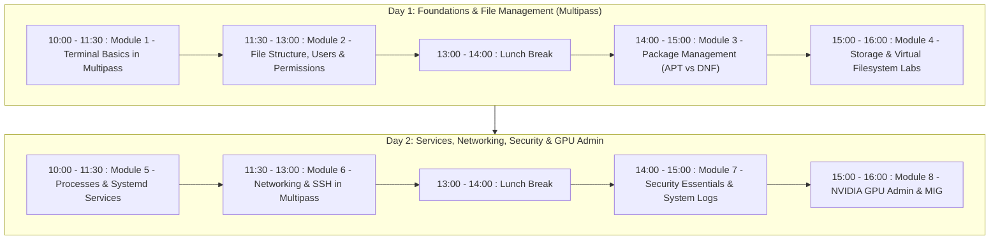

# UKM Warisan Linux Administration Training

[](file:///home/hisham/git/ukm-warisan-linux-administration/LICENSE)
[](https://ubuntu.com/)
[](https://rockylinux.org/)
[](https://multipass.run/)
[](https://www.nvidia.com/)

Welcome to the official repository for the **UKM Warisan Practical Linux System Administration Training**. This repository hosts the comprehensive course syllabus, lab setup instructions, practical hands-on exercises, and administrative cheat sheets for the 2-day intensive workshop.

The complete hands-on lab guide and walk-throughs can be found in [LINUX_TRAINEE_WORKBOOK.md](file:///home/hisham/git/ukm-warisan-linux-administration/LINUX_TRAINEE_WORKBOOK.md).

---

## 📌 Course Overview

This 2-day hands-on course is designed to build foundational and intermediate Linux system administration skills across both major enterprise Linux distribution families: **Debian/Ubuntu** (`apt`) and **RHEL/Rocky Linux** (`dnf`). The training culminates in advanced enterprise infrastructure administration covering **NVIDIA GPU management and Multi-Instance GPU (MIG) partitioning** for AI/HPC workloads.

- **Duration:** 2 Days (10:00 – 16:00 daily)
- **Lunch Break:** 13:00 – 14:00 daily
- **Hands-on Environment:** Canonical Multipass virtual machines (Ubuntu 24.04 & Rocky Linux 9) + Dedicated Remote NVIDIA GPU Server

---

## 📅 Course Schedule & Syllabus



### Module Breakdown

| Day | Time | Module | Description & Practical Focus |
| :--- | :--- | :--- | :--- |
| **Day 1** | 10:00 – 11:30 | **Module 1: Terminal Basics in Multipass** | Terminal anatomy, directory navigation (`pwd`, `cd`, `ls -la`), file management (`mkdir`, `touch`, `cp`, `mv`, `rm`), and text editing with `nano`. |
| | 11:30 – 13:00 | **Module 2: File Structure, Users & Permissions** | Filesystem Hierarchy Standard (FHS), root vs non-root, user/group administration (`useradd`, `passwd`, `usermod`), and permissions (`chmod`, `chown`, octal modes). |
| | **13:00 – 14:00** | **[ Lunch Break ]** | |
| | 14:00 – 15:00 | **Module 3: Package Management (APT vs DNF)** | Enterprise package managers, repository ecosystems, updating, installing services (`nginx`, `htop`), and dependency handling across Ubuntu (`apt`) and Rocky Linux (`dnf`). |
| | 15:00 – 16:00 | **Module 4: Storage & Virtual Filesystem Labs** | Storage telemetry (`df -h`, `du`), virtual loopback disk creation with `dd`, filesystem formatting (`ext4`/`xfs`), mounting, and unmounting. |
| **Day 2** | 10:00 – 11:30 | **Module 5: Processes & Systemd Services** | Process monitoring (`ps`, `top`, `kill`), `systemd` service lifecycle management (`start`, `stop`, `restart`, `status`, `enable`, `disable`). |
| | 11:30 – 13:00 | **Module 6: Networking & Remote SSH Access** | Network diagnostics, port verification, ED25519 SSH keypair generation, passwordless SSH login, and cross-VM networking in Multipass. |
| | **13:00 – 14:00** | **[ Lunch Break ]** | |
| | 14:00 – 15:00 | **Module 7: Security Essentials & Log Analysis** | Centralized logging with `systemd-journald` (`journalctl`), live monitoring with `tail -f`, and security/error log filtering with `grep`. |
| | 15:00 – 16:00 | **Module 8: NVIDIA GPU Admin & MIG** *(Remote Server)* | NVIDIA telemetry with `nvidia-smi`, GPU process tracking, Multi-Instance GPU (MIG) partitioning, workload isolation (`CUDA_VISIBLE_DEVICES`), and instance teardown. |

---

## 🛠️ Lab Setup Instructions

Participants run a dual-distro virtualized lab locally via [Canonical Multipass](https://multipass.run/).

### 1. Install Multipass

- **Windows 10/11 (PowerShell as Admin):**
  ```powershell
  winget install Canonical.Multipass
  ```
- **macOS (Homebrew Terminal):**
  ```bash
  brew install --cask multipass
  ```

### 2. Launch Lab Virtual Machines

```bash
# Launch Ubuntu 24.04 LTS instance
multipass launch 24.04 --name ubuntu --cpus 2 --memory 2G --disk 10G

# Launch Rocky Linux 9 instance
# For Intel / AMD x86_64:
multipass launch https://rocky.mirror.thegigabit.com/9.8/images/x86_64/Rocky-9-GenericCloud-Base.latest.x86_64.qcow2 --name rockylinux --cpus 2 --memory 2G --disk 10G

# For Apple Silicon (M1/M2/M3/M4) aarch64:
multipass launch https://rocky.mirror.thegigabit.com/9.8/images/aarch64/Rocky-9-GenericCloud-Base.latest.aarch64.qcow2 --name rockylinux --cpus 2 --memory 2G --disk 10G
```

### 3. Verify Setup

Access the shells and confirm that `systemd` is running:
```bash
multipass shell ubuntu
systemctl is-system-running

multipass shell rockylinux
systemctl is-system-running
```

---

## ⚡ Quick Reference & Cheatsheet

### Multipass Management
| Action | Command |
| :--- | :--- |
| Enter Ubuntu shell | `multipass shell ubuntu` |
| Enter Rocky Linux shell | `multipass shell rockylinux` |
| List instances & IP addresses | `multipass list` |
| Execute command without entering shell | `multipass exec ubuntu -- <command>` |
| Mount host directory to VM | `multipass mount /host/path ubuntu:/mnt/shared` |
| Stop / Start VM | `multipass stop <name>` / `multipass start <name>` |

### Ubuntu (APT) vs Rocky Linux (DNF)
| Task | Ubuntu (Debian Family) | Rocky Linux (RHEL Family) |
| :--- | :--- | :--- |
| **Package Manager** | `apt` | `dnf` |
| **Package Format** | `.deb` (via `dpkg`) | `.rpm` (via `rpm`) |
| **Update Index** | `sudo apt update` | `sudo dnf check-update` |
| **Upgrade System** | `sudo apt upgrade -y` | `sudo dnf upgrade -y` |
| **Install Package** | `sudo apt install -y <pkg>` | `sudo dnf install -y <pkg>` |
| **Remove Package** | `sudo apt remove <pkg>` | `sudo dnf remove -y <pkg>` |
| **Sudo Group** | `sudo usermod -aG sudo <user>` | `sudo usermod -aG wheel <user>` |
| **Default Filesystem** | `ext4` | `xfs` |
| **SSH Service Name** | `ssh` | `sshd` |

### NVIDIA GPU & Multi-Instance GPU (MIG) Cheatsheet
| Operation | Command |
| :--- | :--- |
| **GPU Overview** | `nvidia-smi` |
| **Live Telemetry** | `nvidia-smi -l 1` |
| **Query CSV Metrics** | `nvidia-smi --query-gpu=index,name,memory.used,memory.total,utilization.gpu,temperature.gpu --format=csv` |
| **Enable MIG Mode** | `sudo nvidia-smi -i 0 -mig 1` |
| **List MIG Profiles** | `nvidia-smi mig -lgip -i 0` |
| **Create MIG Instances** | `sudo nvidia-smi mig -cgi <profile_id> -C` |
| **List Created Instances** | `nvidia-smi mig -lgi` |
| **Bind Workload to Slice** | `export CUDA_VISIBLE_DEVICES="MIG-<UUID>"` |
| **Teardown MIG Slices** | `sudo nvidia-smi mig -dgi -i 0` |
| **Disable MIG Mode** | `sudo nvidia-smi -i 0 -mig 0` |

---

## 📋 Trainee Lab Checklist

- [ ] **Lab 0:** Multipass installed with Ubuntu and Rocky Linux 9 active.
- [ ] **Lab 1:** Navigation, directory creation (`~/training/day1`), and editing with `nano`.
- [ ] **Lab 2:** User management (`alex`), sudo privileges (`sudo`/`wheel`), and permission bits.
- [ ] **Lab 3:** Package installation (`nginx`, `htop`) with `apt` and `dnf`.
- [ ] **Lab 4:** Virtual loopback block device creation, formatting (`ext4`/`xfs`), and mounting to `/mnt/virtual_storage`.
- [ ] **Lab 5:** Systemd service management (`nginx`), autostart verification, and testing HTTP responses.
- [ ] **Lab 6:** ED25519 SSH keypair generation, passwordless login, and cross-VM SSH.
- [ ] **Lab 7:** Live log streaming (`journalctl -f`, `tail -f`) and log filtering (`grep`).
- [ ] **Lab 8:** Remote NVIDIA GPU telemetry (`nvidia-smi`), MIG partitioning, workload assignment, and teardown.

---

## 📂 Repository Contents

- [LINUX_TRAINEE_WORKBOOK.md](file:///home/hisham/git/ukm-warisan-linux-administration/LINUX_TRAINEE_WORKBOOK.md) — Comprehensive step-by-step participant manual, diagrams, and commands.
- [README.md](file:///home/hisham/git/ukm-warisan-linux-administration/README.md) — Course syllabus, quick setup guide, and cheatsheets.
- [LICENSE](file:///home/hisham/git/ukm-warisan-linux-administration/LICENSE) — Creative Commons Zero v1.0 Universal (CC0 1.0) Public Domain Dedication.

---

## 📄 License

This repository and training material are dedicated to the public domain under the [Creative Commons Zero v1.0 Universal](file:///home/hisham/git/ukm-warisan-linux-administration/LICENSE) (CC0 1.0) license.
